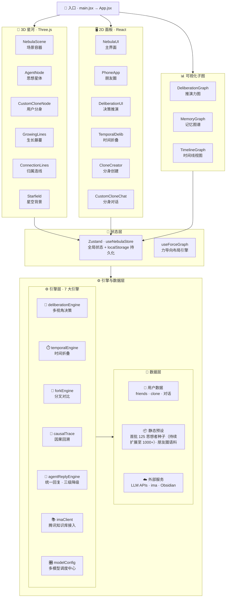

# 🌌 FoldNeb 折叠星云

> **FoldNeb 不是另一个 AI 聊天工具——它是首个让千位思想家在同一星空下帮你做决策的 3D 知识操作系统。**

所有功能都服务于一条主线：**让决策不再依赖单一视角**。1000+ 位思想者（黄仁勋、马斯克、凯文·凯利、老子、王阳明、塔勒布...）化为发光星体，分布在 13 个星系中。无论横向召集圆桌辩论，还是纵向问未来的自己，FoldNeb 把这些头脑变成一个**可调用、有记忆、可视化**的决策智囊团。

### 🎯 为什么这比单个 AI 更可靠？

| 单个 AI 聊天 | FoldNeb 决策操作系统 |
|-------------|---------------------|
| 一个模型一个视角 | 1000+ 位人格交叉验证，谁支持谁反对一眼可见 |
| 对话完就忘 | 记忆晶体永久沉淀，形成会生长的知识星河 |
| 平面文本 | 3D 星河里看观点的引力关系，用空间理解思想 |
| 你问它答 | 横向圆桌 + 纵向时间 + 分叉对比，三维度推演 |

### 🩹 我们解决了什么 — 现有 Agent 领域的三大痛点

> 评分标准明确要求"是否解决了现有 Agent 领域的痛点"。FoldNeb 不是又一个 ChatGPT 套壳，而是对当下 Agent 产品三大硬伤的正面回应：

| 痛点 | 现状（行业普遍做法） | FoldNeb 的解法 | 对应能力 |
|------|---------------------|----------------|----------|
| **① 单 Agent 答案不可靠** | 问一个模型得一个答案，无法验证对错，模型幻觉直接照单全收 | **多 Agent 推演交叉验证**：3-5 位不同流派思想者同台辩论、互相引用、互相反驳，谁支持谁反对一眼可见；不满意还能开「分叉对比」走多条路径量化评分 | 决策推演引擎 + 分叉对比引擎 |
| **② Agent 缺乏个性深度** | 多数"AI 角色"只是 system prompt 一行话，问两句就穿帮，没人设厚度 | **1000+ 位完整人设**：每位思想者有语录 / 核心观点 / 影响力卫星标签 / 代表作 / 传记时间轴 / 深度档案（黄仁勋、马斯克首批补齐 6 类字段），是真正"立得起来"的人格 IP | 思想者星河 + 深度档案 Modal |
| **③ 知识无法沉淀** | 对话完即忘，聊了等于没聊，经验永远停在"一次性" | **知识星球 + 记忆晶体 + Obsidian 一键联动**：每次对话自动提取三元组记忆，生成 3D 金色连线；用户开垦星球作为知识资产容器；一键跳 Obsidian vault 深度沉淀（Web 与本地知识库完全同构） | 记忆引擎 + 知识星球 + Obsidian 联动 |

一句话总结：**别人做的是"更聪明的对话框"，FoldNeb 做的是"让答案可信、让人设有厚度、让知识能生长的操作系统"**。

### 🧠 三条决策路径

| 路径 | 你能做什么 |
|------|-----------|
| 🔥 **横向辩论** | 让马斯克、塔勒布、孙子帮你推演 3 轮 → 多视角交叉验证 |
| ⏳ **纵向透视** | 问你 1/3/5/10 年后的自己 → 用时间维度看清真正重要的 |
| 🔀 **分叉对比** | 同一决策输入多条路径 → 量化评分帮你选最优解 |

---

## 系统架构



---

## 在线体验

- **GitHub Pages**: https://zhouzengxian.github.io/foldneb
- **本地开发**: http://localhost:3000

---

## 项目亮点

> 全部能力服务于一条主线：**决策辅助**。下面 12 项分为三层——决策引擎执行推演，知识底座提供决策对象，呈现生态让决策可信可见。

| 层 | 包含的亮点 | 在决策辅助中的角色 |
|----|-----------|-------------------|
| 🔥 **决策引擎层** | ④ 决策推演 · ⑤ 时间折叠 · ⑥ 分叉对比 | 横向辩论 / 纵向透视 / 路径量化 |
| 🧱 **知识底座层** | ① 思想者星河 · ③ 记忆引擎 · ⑧ 分身系统 · ⑪ Skill 系统 | 决策对象 / 决策记忆 / 用户身份 / 分析能力 |
| 🌌 **呈现与生态层** | ② 力导向布局 · ⑦ 朋友圈 · ⑨ 多模型 · ⑩ Obsidian · ⑫ 知识星图市场 | 空间理解 / 社交传播 / 模型保障 / 知识沉淀 / 资产化 |

### 1. 1000+ 位思想者的 3D 星河宇宙

13 个星系（AI前沿、认知决策、战略博弈、资本周期、思想源流...）环绕中心，每位思想者是一颗多层发光星体（首批已入库 125 位种子，目标 1000+）：

| 视觉层 | 实现 |
|--------|------|
| 核心 | Canvas 径向渐变纹理 + 四向十字光芒 |
| 光环 | 双层旋转 Ring + 脉冲呼吸动画 |
| 卫星粒子 | 每位 Agent 2-3 颗标签卫星（如 CUDA、ChatGPT）环绕 |
| 影响力星云 | 三层粒子壳，颜色随星系主题变化 |
| 深空背景 | 2500 颗深空星 + 500 粒宇宙尘埃 |

### 2. 力导向布局 — 节点自然聚集

基于物理模拟的力导向算法（`useForceGraph.js`），让相关思想者的星体自然靠近：

- **引力**：有连线关系的节点互相吸引
- **斥力**：所有节点之间存在排斥，避免重叠
- **星系引力**：同星系节点向星系圆心聚集
- **中心引力**：全局向原点收束，防止节点飞散

### 3. 折叠记忆引擎 — 记忆永不重置

每次 Agent 之间的对话或互动，自动提取记忆晶体（知识三元组），在 3D 星河中生成金色连线。

三种提取精度：

| 精度 | 方式 | 场景 |
|------|------|------|
| CRYSTAL | LLM 提取精确三元组 | 对话完成后调用大模型 |
| FRAGMENT | 关键词快速匹配 | 社交评论实时处理 |
| DUST | 截取文本前 15 字 | 匹配失败降级兜底 |

所有关系经过 `AGENT_ALIAS_MAP`（42 个 Tier-1 Agent 双向别名映射表）验证，确保知识图谱的准确性。

### 4. 决策推演引擎 — 多 Agent 圆桌辩论

输入你的商业卡点，系统自动：

1. 分析问题领域，匹配最相关的 3-5 位 Agent
2. 多轮推演，Agent 依次发言并引用彼此观点
3. Canvas 实时绘制推演脉络网络
4. 一键导出截图报告

支持 API 实时模式（调用大模型）和 Demo 模式（预置语料离线运行）。

### 5. 时间折叠引擎 — 「问未来的自己」

纵向时间维度决策辅助，不同于圆桌辩论的横向视角：

1. **生成 4 个未来的你**：基于当前处境，大模型模拟 1/3/5/10 年后的人格（心情、心态、人生阶段）
2. **写信给现在的你**：每位未来自我生成一封信，给出基于时间视角的建议
3. **跨时间互评**：1 年后 vs 10 年后的你对彼此的观点互相评价
4. **收束锚点矩阵**：综合所有时间视角，生成可执行的行动锚点

从决策推演完成态可「一键带入」上下文（核心发现→现状、行动建议→目标、争议→担忧、重新框定→决策）。支持 API 和 Demo 模式。

### 6. 分叉对比引擎 — 多路径量化评估

对同一决策输入多条替代路径，系统为每条路径生成未来自我画像 + 时间锚点矩阵，通过加权评分体系（一致性与分歧度 + 锚点强度 + 时间多样性）输出排名，辅助对比选择。

### 7. 朋友圈社交系统

拟真 iPhone 外观的朋友圈界面：

- 11 位 Agent 每日自动发布动态（167 条预置语料）
- 点赞、评论，Agent 根据内容自动回复
- 评论中提及的 Agent 自动提取记忆晶体
- 用户分身化作星河中的金色发光节点

### 8. 用户分身系统 — 你也是星河中的一颗星

首次引入"用户身份层"，创建专属思想分身，化身星河中的金色发光节点：

- **一键创建**：名字 + 头像 emoji + 一句话人设 + 性格风格 + 回复模式，4 个预设模板（星海探索者 / 智慧导师 / 灵感缪斯 / 理性助手）一键填入
- **三级回复模式**：
  - 模板模式：零配置，关键词匹配兜底，永远能聊
  - AI 模式：调用大模型，基于人设生成回复
  - 知识库模式：接入腾讯 ima 知识库，检索资料 + 大模型生成
- **星河锚定**：分身创建后化身金色发光节点，用青白色归属线锚定在你的身旁
- **统一回复引擎**：按配置逐级降级（知识库 → AI → 模板），保证对话永不中断

### 9. 五大模型自由切换

内置 5 家大模型提供商，设置面板一键切换，支持请求 JSON 预览和一键测试连接。

### 10. Obsidian 知识库联动

每位 Agent 星体可直接跳转到 Obsidian Vault 中的对应笔记，Web 可视化与 Obsidian 知识库完全同构。

### 11. 🦐 Skill 系统 — 用户可编辑的 AI 分析能力

右栏「Skill 库 ▼」管理 **用户可编辑、可新增、可切换的 Skill（大模型指令模板）**：

- **内置 Skill**：🦐 商业动态逻辑情报虾（结构/逻辑/未来三层框架，拆解商业领袖底层逻辑）
- **全 CRUD**：编辑 prompt / 新建自己的 Skill / 切换激活 / 导出 md / 重置内置
- **占位符复用**：prompt 里写 `{{agent.name}}` `{{agent.title}}` `{{agent.philosophy}}`，一个模板复用到 125 个思想者
- **三渠道留痕**：项目内源文件（git）+ Obsidian vault `5_skill库`（iCloud 同步）+ 运行时「⬇ 导出 md」

点「🦐 商业动态逻辑情报虾 · 一键生成」即按当前 Skill 的指令框架，由大模型实时产出该人物的深度商业情报分析，渲染在右栏。

### 12. 🌌 知识星图市场 — AI 时代知识交易平台雏形

不是「又一个笔记 App」，而是把知识**资产化、Agent 化、可视化**的下一代知识平台三层跃迁：

| 跃迁 | 传统知识星球 | FoldNeb 知识星图市场 |
|------|--------------|----------------------|
| **知识形态** | 静态文字 / 音频 | 可对话的知识体（Agent 化，1000+ 位思想者 = 1000+ 个原生 IP）|
| **价值放大** | 作者一人写 | AI 衍生（总结 / 问答 / 对比 / 推演自动产出）|
| **消费方式** | 被动阅读 | 主动调用（决策推演 / 时间折叠 / 圆桌辩论）|
| **资产形态** | 一次订阅 | 可视化的 3D 月球（活跃度 / 连接度 / AI 协作度看得见）|

用户分身 = 生产入口，星球月球 = 知识资产容器，决策推演 = 消费场景，朋友圈 = 传播层，Obsidian = 沉淀层。**当 GPT 让内容生产无限廉价，稀缺的不再是内容，而是可信、可交互、有人格的知识资产。**

---

## 🌐 SoloVerse 集成 — 为 Agent 互联生态贡献什么

> SoloVerse 是 Agent 互联生态——让分散的 AI Agent 能被发现、被组合、被协同调用。FoldNeb 作为决策辅助垂直场景，为 SoloVerse 生态贡献三个核心层：

### FoldNeb 对 SoloVerse 的三大贡献

| 贡献层 | FoldNeb 提供的能力 | 在 SoloVerse 中的角色 |
|--------|-------------------|----------------------|
| **① 即用 Agent 池** | 1000+ 位思想者 Agent（首批入库 125 位种子），每位有完整人设 / 语录 / 深度档案 / 预置回复风格 | SoloVerse 生态里开箱即用的**高人格密度 Agent 资源**——不是空壳 system prompt，而是可直接被其他应用调用的「有灵魂」的 Agent |
| **② 治理 / 决策工具** | 决策推演引擎（多 Agent 圆桌辩论）+ 时间折叠引擎（纵向视角）+ 分叉对比（多路径量化评分） | SoloVerse 多 Agent 协同的**治理层**——当生态里多个 Agent 意见冲突时，用 FoldNeb 的推演 / 对比机制做交叉验证和冲突仲裁 |
| **③ 知识资产层** | 知识星球（3D 月球容器）+ 记忆晶体（自动沉淀三元组）+ Obsidian 联动 | SoloVerse Agent 间知识共享的**沉淀层**——Agent 协作产生的洞察不会消散，而是凝结为可视化、可追溯、可复用的知识资产 |

### 为什么 FoldNeb 是 SoloVerse 不可或缺的一环

```
SoloVerse 生态三层缺口：

  ❌ 缺人格密度       →  FoldNeb 千位思想者填补
  ❌ 缺冲突仲裁       →  FoldNeb 推演引擎填补
  ❌ 缺知识沉淀       →  FoldNeb 知识星球 + 记忆填补
```

大多数 Agent 平台都在做"**连接**"（让 Agent 互相能调），但缺三样东西：

1. **人格密度**——SoloVerse 里大量 Agent 是 prompt 一行话的工具人，FoldNeb 的 1000+ 位思想者是真正"有出身、有观点、有代表作"的思想者 IP
2. **冲突仲裁**——多个 Agent 给出矛盾答案时怎么办？FoldNeb 的圆桌推演 + 分叉对比就是为这种场景设计的决策治理工具
3. **知识沉淀**——Agent 间协作产生的洞察通常一次性挥发，FoldNeb 的记忆晶体 + 知识星球让它们成为可持续复用的资产

### 集成接口（已就位 / 规划中）

| 接口 | 状态 | 说明 |
|------|------|------|
| 首批思想者 Agent 预置语料 + 深度档案 | ✅ 已就位 | `gameData.js` 结构化导出（首批 125 位种子，可被 SoloVerse 其他节点直接消费）|
| 统一回复引擎（三级降级） | ✅ 已就位 | `agentReplyEngine`：知识库 → AI → 模板逐级降级，保证 Agent 永远有响应，适合做生态里的稳定 Agent 节点 |
| 多模型调度中心 | ✅ 已就位 | `modelConfig.js` 支持 5 家大模型，可被生态共享复用 |
| Agent 协议标准化 | 🔜 规划中 | 暴露标准化 schema（人设 / 能力 / 回复风格），供 SoloVerse 调度器发现和组合 |
| 跨应用推演调度 | 🎯 愿景 | FoldNeb 推演引擎能调用生态里其他 Agent 参与圆桌，不止用本地思想者 |

---

## 快速开始

### 环境要求

- Node.js >= 18
- npm >= 9

### 安装与运行

```bash
# 安装依赖
npm install

# 启动开发服务器（默认端口 3000）
npm run dev

# 浏览器打开 http://localhost:3000
```

### 构建与预览

```bash
npm run build     # 构建到 dist/
npm run preview   # 本地预览构建产物
```

---

## 技术架构

### 技术栈

| 层 | 技术 | 版本 |
|----|------|------|
| 3D 渲染 | Three.js + @react-three/fiber + @react-three/drei | three 0.169 |
| 后处理 | @react-three/postprocessing | 3.0 |
| 动画 | GSAP | 3.15 |
| 状态管理 | Zustand（localStorage 持久化） | 5.0 |
| UI 框架 | React + TailwindCSS | React 18 |
| 构建工具 | Vite | 6.0 |

### 架构总览

```
App.jsx
 ├── NebulaScene          3D 主场景（Canvas）
 │    ├── AgentNode        星体节点（Canvas 纹理 + 光环 + 卫星）
 │    ├── ConnectionLines  静态连线 + 记忆金线
 │    ├── GrowingLines     生长动画连线
 │    ├── DeepSpace        深空星 + 宇宙尘埃
 │    ├── GalaxyAtmosphere 星系粒子雾气氛
 │    ├── DemoController   Demo 巡游特效
 │    └── DistrictGround   星系地面标记
 │
 ├── NebulaUI             2D HUD 界面
 │    ├── SearchBar        搜索定位
 │    ├── AgentDetail      Agent 详情面板
 │    ├── MemoryCounter    记忆晶体计数
 │    ├── OnboardingGuide  新手引导
 │    └── DistrictFilter   星系筛选
 │
 ├── PhoneApp             朋友圈浮层（iPhone 外观）
 │
 ├── DeliberationUI       决策推演浮层
 │    ├── DeliberationGraph   推演脉络 Canvas
 │    └── DeliberationHistory 推演历史记录
 │
 └── TemporalDeliberation 时间折叠浮层
      ├── TemporalSubViews.IdleForm  表单入口
      ├── TemporalSubViews.CompleteView  锚点矩阵结果
      └── ForkCompareSection         分叉对比面板
```

### 全局状态 (Zustand)

`useNebulaStore.js` 管理所有应用状态，关键数据通过 localStorage 持久化：

| 状态域 | 说明 | 持久化 |
|--------|------|--------|
| 3D 交互 | 选中/悬停/聚焦 Agent、相机目标 | 否 |
| 记忆系统 | 记忆晶体三元组 `{source, relation, target}` | 是 |
| 朋友圈 | 用户资料、好友列表、点赞、评论 | 是 |
| 决策推演 | 推演会话、历史记录 | 是 |
| 时间折叠 | 折叠会话（未来自我/信件/互评/锚点矩阵）、分叉对比结果 | 否 |
| 模型配置 | API Key、模型选择 | 是 |

### 数据流

```
gameData.js (125 Agent + 13 星系 + 连线)
       │
       ▼
useForceGraph (物理模拟 → 动态坐标)
       │
       ▼
NebulaScene (渲染星体 / 连线 / 粒子)
       │
       ├── 用户点击/搜索 ──→ useNebulaStore ──→ AgentDetail 面板
       │
       ├── Agent 对话 ──→ memoryCrystal 提取 ──→ GrowingLines 金色连线
       │
       ├── 决策推演 ──→ deliberationEngine ──→ modelConfig 调用 LLM
       │
       └── 时间折叠 ──→ temporalEngine ──→ modelConfig 调用 LLM
                        └── forkEngine 分叉对比
```

---

## 核心功能详解

### 星河探索

- **自由视角**：鼠标拖拽旋转、滚轮缩放、右键平移
- **自动旋转**：空闲时镜头缓慢环绕，点击任意节点停止
- **星系筛选**：点击底部星系标签，仅高亮该星系节点
- **搜索定位**：输入名字，镜头 GSAP 飞行动画到目标星体并高亮

### Agent 详情面板

点击任意星体弹出详情面板，包含：

- 基本信息（名字、头衔、描述、标签）
- 原创语录 / 核心观点
- 影响力卫星标签（如黄仁勋的 CUDA、DGX、GPU 算力）
- 一键跳转 Obsidian — 打开对应笔记
- 触发对话 — 自动提取记忆晶体

### 决策推演

1. 点击右下角「决策推演」按钮
2. 输入你的商业难题（如「我的 SaaS 产品增长停滞」）
3. 系统分析问题领域，智能匹配 3-5 位 Agent
4. Agent 多轮发言，实时显示在推演脉络图中
5. 完成后可查看推演历史、导出截图

### 时间折叠

1. 点击右下角「时间折叠」按钮
2. 填写现状、目标、担忧、关键决策（或从决策推演一键带入）
3. 选择 🌐 API 或 🎬 Demo 模式
4. 系统依次生成 4 个未来自我 → 写信 → 跨时间互评 → 锚点矩阵
5. 展开「分叉对比」，输入替代路径进行多方案量化评估

设置面板支持：

- 切换大模型提供商（5 家可选）
- 输入 API Key（仅存储在本地，不上传服务器）
- 查看完整请求 JSON 预览（调试 API 格式）
- 一键测试连接（发送最小请求验证可用性）

### 朋友圈

- 点击右侧「朋友圈」竖排按钮展开
- 浏览 Agent 日常动态（每日刷新）
- 点赞 / 评论，Agent 会根据内容自动回复
- 评论中提及其他 Agent 会自动提取记忆晶体

### Demo 巡游

- 点击 Demo 按钮触发 60 秒星河巡游
- GSAP 镜头飞行，依次聚焦 6 位关键 Agent
- 金色脉冲球体 + 蝴蝶尾迹特效

---

## Demo 模式 vs API 模式

决策推演和时间折叠均支持两种运行模式，通过面板顶栏一键切换：

| 模式 | 数据来源 | 需要 API Key | 适用场景 |
|------|----------|:-----------:|----------|
| 🌐 **API** | 实时调用大模型生成 | ✅ | 真实场景、个性化结果 |
| 🎬 **Demo** | 预置语料 + 假数据 | ❌ | 快速体验流程、离线环境 |

- **决策推演**：Demo 模式使用 `deliberationDemos.js` 中的预置语料
- **时间折叠**：Demo 模式使用确定性 fallback 函数（`temporalEngine.js`），每条分叉路径随机化人格态度产生评分配置差异

所有 Demo 页面会显示绿色「🎬 演示数据」横幅，确保用户清楚当前为模拟结果。

---

## 多模型接入

### 配置方式

1. 点击决策推演面板的设置按钮
2. 选择模型提供商
3. 输入 API Key（仅存储在本地 localStorage）
4. 选择模型版本
5. 点击「测试连接」验证

### 支持的模型

| 提供商 | API 地址 | 模型 | 获取 Key |
|--------|----------|------|----------|
| 小米 MiMo | `api.xiaomimimo.com` | `mimo-v2-pro` / `mimo-v2-flash` | platform.xiaomimimo.com |
| 智谱 GLM | `open.bigmodel.cn` | `glm-5.1` / `glm-4.7` / `glm-4.6` | open.bigmodel.cn |
| DeepSeek | `api.deepseek.com` | `deepseek-chat` / `deepseek-reasoner` | platform.deepseek.com |
| Kimi | `api.moonshot.cn` | `moonshot-v1-8k/32k/128k` | platform.moonshot.cn |
| MiniMax | `api.minimax.chat` | `abab6.5s-chat` / `abab7-chat-preview` | platform.minimax.io |

### CORS 代理

GitHub Pages 等静态托管下浏览器直接请求外部 API 会触发 CORS 拦截。系统内置自动检测：

- `localhost` / `127.0.0.1` / `192.168.*` → 直连，无需代理
- 其他域名 → 自动启用 `corsproxy.io` 代理
- 可在设置面板手动覆盖代理地址

### 特殊适配

- **GLM-5.x / GLM-4.7 thinking mode**：自动添加 `thinking: { type: "disabled" }` 参数关闭思维链，并在响应解析时回退读取 `reasoning_content` 字段
- **API 并发限流**：多 Agent 推演使用 worker 池模式（默认 2 并发 + 1 次重试），避免超出 API 限流

---

## Obsidian 联动

FoldNeb 的 Web 数据与 Obsidian Vault 完全同构，点击 Agent 详情面板中的「Obsidian」按钮可直接跳转到对应笔记。

### Vault 结构

```
AI一人公司/
└── 11-黑客松大赛/折叠星云agent数据库/
    ├── 0_索引导航/          14 个文件（13 坊区索引 + 知识星图总览）
    ├── 1_智慧星河/          Tier-1 思想者（13 个数字前缀子目录，首批 125 位，持续扩展至 1000+）
    ├── 2_精英星团/          Tier-2（13 子目录，含 _旧版遗珍）
    ├── 3_叙事脚本/
    ├── 4_朋友圈/
    └── 过程文件/
```

### 跳转原理

通过 `obsidian://` URI 协议：

```
obsidian://open?vault=AI一人公司&file=11-黑客松大赛/折叠星云agent数据库/1_智慧星河/1-AI前沿/黄仁勋.md
```

`obsidianLink.js` 中实现了三级降级策略：

1. `window.open(uri)` — 首选方案
2. `window.location.href = uri` — 备用
3. 创建隐藏 `<a>` 标签点击
4. 复制 URI 到剪贴板 — 最终兜底

---

## 项目结构

```
foldneb/
├── public/                         # 静态资源
├── src/
│   ├── main.jsx                    # 入口
│   ├── App.jsx                     # 根组件
│   ├── index.css                   # 全局样式
│   │
│   ├── data/
│   │   ├── gameData.js             # 125 Agent + 13 星系 + 初始连线
│   │   └── agentMoments.js         # 朋友圈语料（167 条）
│   │
│   ├── store/
│   │   └── useNebulaStore.js       # Zustand 全局状态
│   │
│   ├── hooks/
│   │   └── useForceGraph.js        # 力导向布局物理引擎
│   │
│   ├── components/
│   │   ├── NebulaScene.jsx         # 3D 场景主容器
│   │   ├── AgentNode.jsx           # 星体节点（Canvas 纹理）
│   │   ├── AgentSatellites.jsx     # 卫星粒子
│   │   ├── InfluenceNebula.jsx     # 影响力星云
│   │   ├── ConnectionLines.jsx     # 连线系统
│   │   ├── GrowingLines.jsx        # 生长记忆金线
│   │   ├── DeepSpace.jsx           # 深空星 + 尘埃
│   │   ├── GalaxyAtmosphere.jsx    # 星系粒子雾
│   │   ├── DistrictGround.jsx      # 星系地面标记
│   │   ├── HeroSatellites.jsx      # 关键 Agent 特殊卫星
│   │   ├── SparkleField.jsx        # 闪烁粒子场
│   │   ├── Starfield.jsx           # 星场背景
│   │   ├── DemoController.jsx      # Demo 巡游特效
│   │   ├── DialoguePanel.jsx       # 对话面板
│   │   ├── NebulaUI.jsx            # 2D HUD 主界面
│   │   ├── SearchBar.jsx           # 搜索定位
│   │   ├── AgentDetail.jsx         # Agent 详情面板
│   │   ├── ConnectionDetail.jsx    # 连线详情
│   │   ├── MemoryCounter.jsx       # 记忆晶体计数
│   │   ├── MemoryGraph.jsx         # 记忆图谱可视化
│   │   ├── OnboardingGuide.jsx     # 新手引导
│   │   ├── PhoneApp.jsx            # 朋友圈浮层
│   │   ├── UserAvatar.jsx          # 用户分身节点
│   │   ├── DeliberationUI.jsx      # 决策推演界面
│   │   ├── DeliberationGraph.jsx   # 推演脉络 Canvas
│   │   ├── DeliberationHistory.jsx # 推演历史
│   │   ├── TemporalDeliberation.jsx # 时间折叠主组件
│   │   ├── TemporalSubViews.jsx    # 时间折叠子组件（表单/结果/分叉对比）
│   │   ├── TextSprite.jsx          # 3D 文字标签
│   │   └── LinesLayer.jsx          # 连线分层管理
│   │
│   └── utils/
│       ├── modelConfig.js          # 多模型配置中心（5 家大模型）
│       ├── deliberationEngine.js   # 决策推演引擎
│       ├── deliberationDemos.js    # 推演 Demo 语料
│       ├── temporalEngine.js       # 时间折叠引擎（未来自我/写信/锚点）
│       ├── forkEngine.js           # 分叉对比引擎（多路径评分）
│       ├── memoryCrystal.js        # 折叠记忆晶体提取
│       ├── obsidianLink.js         # Obsidian URI 跳转
│       ├── audio.js                # 音效系统
│       └── reportImage.js          # 报告截图导出
│
├── index.html                      # HTML 入口
├── vite.config.js                  # Vite 配置（base: './'）
├── tailwind.config.js              # TailwindCSS 配置
├── package.json
└── README.md
```

---

## 部署指南

### GitHub Pages

```bash
# 构建并部署
npm run build
npx gh-pages -d dist
```

项目已配置 `base: './'`（相对路径），适配 GitHub Pages 子目录托管。

### 其他静态托管

```bash
npm run build
# 将 dist/ 目录上传到任意静态服务器
```

---

## 版本历史

| 版本 | 主要内容 |
|------|----------|
| **初始化** | 项目初始化，确定 FoldNeb 折叠星云方向 |
| **V1.0** | 完整构建（6 个 Phase 全部完成）：基础 3D 星河可视化、星体渲染、相机交互 |
| **V2.0** | 重大升级：125 Agent 星体扩展 + 力导向布局 + FoldNeb 折叠星云视觉重构 + Obsidian 关联跳转 + GitHub Pages 部署 |
| **V2.1** | 功能集成：朋友圈社交系统 + 决策推演引擎 + 多模型 API 系统 + CORS 代理支持 + 错误信息透传到 UI |
| **V2.2** | 模型优化：DeepSeek 设为默认 + 清理失效端点 + 智谱 Coding Plan 专属端点（GLM-4.7 / 4.6 / 4.6v）+ 无 Key 提前拦截 |
| **V2.3** | 体验打磨：打字机语录逐字气泡 + 右侧面板信息密度提升 + 小米 MiMo 接入 + GLM-5.1 thinking 模式适配 + 推演脉络字体变形修复 + 请求 JSON 预览 / 测试连接 + API 并发限流修复 |
| **V2.4** | 推演图谱增强：Zep 风格节点出生弹性动画 + 全连线粒子流 + 图谱节点点击交互 + hover 高亮 + 记忆晶体图谱关系类型多色映射 + 节点详情面板 |
| **V3.0** | 🌌 **时间折叠大版本**：纵向时间维度决策引擎（生成 4 个未来自我 → 写信给过去 → 跨时间互评 → 锚点矩阵）+ Canvas 2D 时间轴可视化 + 决策推演→时间折叠一键联动 + Demo/API 双模式 + API 失败明示错误（移除静默兜底，杜绝"瞎说"） |
| **V3.1** | 分叉对比引擎：多替代路径并行量化评估（终局评分/排序/对比洞察）+ 未来自我追问对话（LetterCard 内联聊天，注入人格快照） |
| **V3.2** | 因果回溯引擎：纯计算模块追溯锚点判断的因果链（赞同方/反对方证据）+ 锚点卡片可展开因果详情面板 + causalSummary 一句话因果总结 |
| **V4.0** | 🧬 **分身系统大版本**：用户创建专属思想分身（名字/头像/人设/性格/回复模式）→ 化身星河金色发光节点 + 青白归属线锚定 + 4 个预设模板一键填入 + 三级回复模式（模板/AI/知识库）+ 腾讯 ima 知识库接入 + 统一回复引擎逐级降级（永远能聊） |
| **V4.1** | 📖 **思想者深度档案**：黄仁勋/马斯克首批补齐 6 类深度字段（传记/时间轴/核心思想/语录/代表作/启示）→ Modal 6 大版块带视觉分隔；graceful fallback 让 123 个无深度字段 agent 不破坏 |
| **V4.2** | 🦐 **Skill 化大版本**：商业情报分析从硬编码 prompt 升级为**用户可编辑/新增/切换的 Skill 系统**（内置「商业动态逻辑情报虾」三层框架）+ Skill 管理面板（列表/编辑/导出/重置）+ 三渠道本地留痕（项目源 + Obsidian vault `5_skill库` + 运行时导出 md） |
| **V4.3** | 📊 **档案时间线 + 宽屏适配 + API 统一**：① 情报分析改为**时间线折叠结构**（`analysisHistory` 数组，最新情报置顶 + 历史情报按日期折叠展开，黄仁勋首批 2 条：2026-06-14 Computex 新情报 + 2026-04-20 原情报）② 档案 Modal **宽屏优化**（1280px+ 断点撑宽到 1160px / Grid 自适应模块拼排 / sticky 顶部工具条只钉工具不钉整栏，解决左右两栏下滑不同步）③ 档案页 API **统一到决策推演共享的 Provider 机制**（`getArchiveProvider` 复用 `getEffectiveConfig` + `getCorsProxyUrl`，配一次密钥两边可用） |
| **V4.4** | 📱 **朋友圈大版本·仿微信完整社交闭环**：① **顶部搜索框**可检索全星河 agent（`tier1Agents.filter`），点击结果直接进 Agent 主页 ② **Agent 头像 / 昵称可点开**进入仿微信个人主页（`AgentDetailScreen`：封面+头像+今日动态+关注按钮+「🌌 在星河中查看详情」一键跳 3D 详情页）③ **我的头像可点开**「我的朋友圈」主页（`UserMomentsScreen`：展示我所有已发布动态）④ **可自行发布朋友圈**（封面右上角相机按钮 → `ComposePost` 浮层：文本输入 + 12 个表情配图 + 200 字限制）⑤ **发布后自动触发 agent 反应**（`triggerAgentReactions`：1-2 位已加好友随机点赞/评论，含延迟） |
| **V4.5** | 🌑 **知识星球板块**：① 用户可注册自己的星球，同时在 3D 星空中化作**不发光的灰白月球天体**（程序化坑洞纹理 + 自转 + 环绕分身轨道分布，点击进详情）② 手机端底部新增「星球」Tab，星球列表/详情页仿知识星球设计 ③ 星主既可**手动发表**文字内容，也可点「✨ 让 AI 替我生成一篇」由 AI 基于星球主题自动产出笔记 |
| **V4.6** | 🌑 **月球公转 + 星空定位**：① 知识星球月球从静态环绕升级为**动态公转**（共享轨道公式 `moonOrbitSpeed`/`moonOrbitRadius` + `OrbitRings` 轨道环 + `calcMoonWorldPos` 相机跟踪同步）② 手机端星球详情页「🛰️ 定位这颗月球」按钮一键聚焦星空中的月球（gsap 推近 + useFrame `target.lerp` 跟随公转 + 冷月光发光高亮）③ 月球配色统一为冷月光蓝白 |
| **V4.7** | 💎 **知识资产价值面板 + 商业叙事立柱 + 双场景 Demo**：① 新增 `PlanetValuePanel` 组件——每颗星球详情页顶部展示**知识资产价值可视化**：4 个核心指标（知识卡片数 / AI 衍生次数 / 平均深度 / 活跃指数）+ 5 维 SVG 雷达图（产出 / AI 协作 / 深度 / 频率 / 广度），全部基于 posts 真实数据实时计算，含智能判语（🔥高价值 / ✨成长中 / 🌱新生）。这是「知识星图市场」叙事的功能级强加分实现 ② **README 商业叙事三段升级**：顶部「这是什么 — 你的 3D 思考舱」三场景卡片定位 / 亮点第 12 条「知识星图市场 — AI 时代知识交易平台雏形」三层跃迁表 / 压轴商业化愿景 + 协同地图 + 路线图 ③ **星球板块文案呼应叙事**：发表→铸造、创建→开垦、知识星球→知识星图市场（5 处）④ **首屏 Onboarding 升级为「3D 思考舱」三场景定位卡**（`OnboardingGuide.jsx` 第 1 步改写 + `whiteSpace:pre-line` 分段渲染，与 README 顶部一一呼应）⑤ **双场景 Demo 入口**（`ScenarioDemos.jsx`）：工具栏新增「🎬 场景 Demo」按钮 → 弹紫色浮层含两张卡片——「💼 创业者推演」（自动预填 P6「SaaS 增长停滞」+ 切 Demo 模式跑马斯克/黄仁勋/塔勒布 3 轮推演，report 末尾引导时间折叠横纵联动）/「🎓 学生探索」（聚焦庄子 + 弹详情含金色连线「超人vs逍遥」到尼采 + 一键跳 Obsidian）。store 新增 `deliberationPrefill` + `openDeliberationWithPrefill` + `clearDeliberationPrefill` 三个 action，DeliberationUI 加 useEffect 自动吸收预填并启动 Demo。`deliberationDemos.js` 新增 P6 含 `nextStepHint` 字段，DeliberationUI 加渲染区。 |
| **V4.8** | ⚡ **转场精简 + autoStart 修复**：① 删除 `DeliberationTransition` 转场动画组件（横向光线→纵向时间线隧道），`handleLaunchTemporal` 从 1s 隧道动画改为直接 `closeDeliberation` → `openTemporalWithPrefill` 同步衔接 ② `TemporalDeliberation` autoStart 链路简化：从异步逐字打字机改为 `setProfile` 直接赋值 + `setTimeout(150ms)` 后 `startRef.current()` 启动 ③ 移除 `typeProfileField` 回调（不再需要）④ ⚠️ 已知问题：场景 Demo→时间折叠自动衔接偶尔不触发（`startRef` 闭包/竞态），待后续 debug |
| **V4.9** | 🔇 **星河巡游体验优化**：① 开发进度 84% → 90% ② 工具栏精简，只保留核心主流程（星河巡游 / 创建分身 / 十三星系 / 搜索），待完善功能统一收纳 ③ 星河巡游默认静音，音效与旁白朗读联动（不朗读时自动静音）④ 新增「跳过巡游」按钮，可随时强制结束演示 |
| **V4.10** | 🎙️ **配音系统 + API 全平台统一**：① **星河巡游预录制语音旁白**（`scripts/generate-narration.cjs`）：微软 Edge TTS（晓晓 zh-CN-XiaoxiaoNeural）合成 8 段高质量自然语音 MP3 到 `public/narration/`，`NebulaScene.jsx` 三层回退（预录音 → 浏览器 Neural TTS → 基础 TTS），旁白开关统一受 `narrationEnabled` 控制，不朗读时自动静音 ② **全量定位升级**：所有营销描述从「125 位」→「1000+ 位思想者 · 83 亿个人生 · 1 万亿个灵魂」，数据层保留「首批 125 位种子（持续扩展至 1000+）」事实标注 ③ **API 全平台统一**（`modelConfig.js`）：新增 `getUnifiedProvider()` / `setUnifiedProvider()` 持久化 localStorage，4 个引擎（决策推演/时间折叠/朋友圈分身/档案分析）统一读取同一份 Provider 选择——配一次 Key 全平台生效，切换模型一处同步，删除 4 处独立 Provider 变量（`setDeliberationProvider`/`setTemporalProvider`/`setMomentsProvider`/`setArchiveProvider` 改为同名别名兼容）④ 左上角「搜索思想者」↔「十三星系」对调 ⑤ 右下角「决策推演」↔「时间折叠」对调 ⑥ 开发者工具「待完善功能」→「更多功能」 |

---

## 🚀 商业化愿景与路线图

### AI 时代知识交易平台雏形

FoldNeb 不是"给知识星球加了个交易平台"，而是"**它本来就是一个知识平台的雏形，叙事只是还没点破**"。底层基础设施已全部就位：

| 已有能力 | 在平台叙事中的角色 |
|----------|-------------------|
| 思想者 Agent 池 | 平台天然的**供给侧种子库**（首批 125 位可对话的原生 IP，持续扩展至 1000+）|
| 分身系统 | 用户侧的**生产入口**（创建分身 → 注册星球 → 成为生产者）|
| 决策推演 / 时间折叠 | 知识的**消费场景**（不只是"读"，而是"被调用产生决策价值"）|
| 朋友圈社交 | **传播层**（知识在社交关系里流动、被点赞、被评论）|
| Obsidian 联动 | **深度沉淀层**（知识有出处和延伸，不是孤立碎片）|

### 协同地图

```
                ┌─────────────────────────┐
                │  知识星图市场（叙事顶层） │
                └────────────┬────────────┘
                             │
        ┌────────────┬───────┼───────┬────────────┐
        ▼            ▼       ▼       ▼            ▼
   千位思想者    分身系统  知识星球  决策推演     朋友圈
   (供给侧IP)   (生产入口) (月球容器)(消费场景)   (传播层)
        │            │       │       │            │
        └────────────┴───┬───┴───────┴────────────┘
                         ▼
                  Obsidian 联动
                  (深度沉淀层)
```

每一个已有功能都能在"交易平台"叙事里找到位置——**不需要新增功能，只需要重新组织叙事**。

### 路线图

| 阶段 | 能力 | 状态 |
|------|------|------|
| **当前（雏形）** | 单机知识资产化 + 可视化 + AI 衍生 + 社交传播 | ✅ 已实现 |
| **下一步** | 账户体系 + 订阅 + 多创作者入驻 | 🔜 规划中 |
| **远期** | 知识资产可组合 / 可授权 / 可复用的完整交易市场 | 🎯 愿景 |

> 当 GPT 让内容生产无限廉价，**稀缺的不再是内容，而是可信的、可交互的、有作者人格的知识资产**。FoldNeb 就是在做这件事的基础设施。

---

## 许可证

MIT
